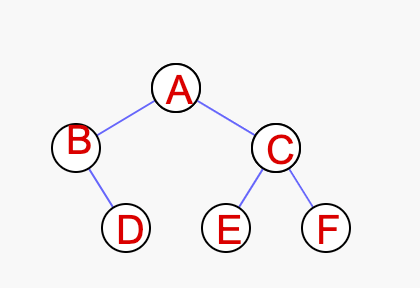
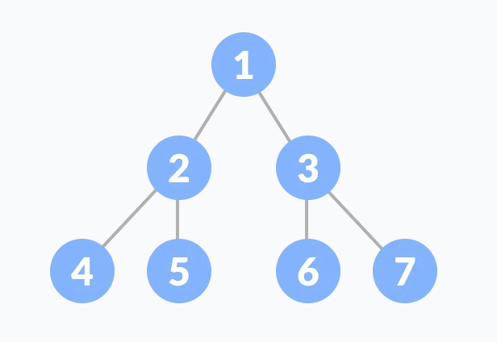
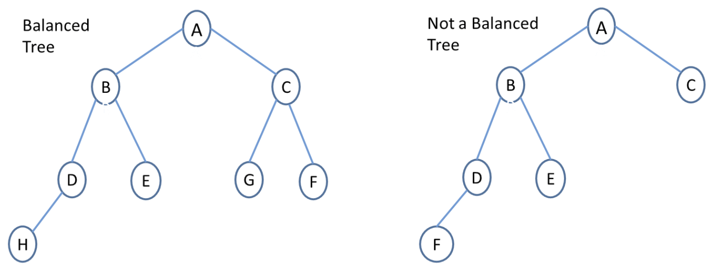
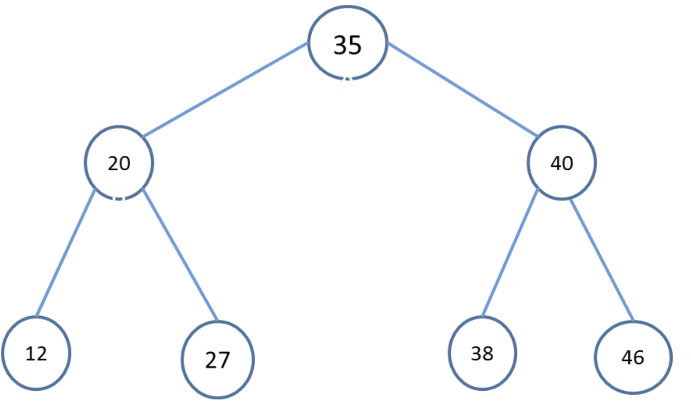

## Tree

A tree is a hierarchical data structure defined as a collection of nodes. Nodes represent value and nodes are connected by edges. A tree has the following properties:

* The tree has one node called root. The tree originates from this, and hence it does not have any parent.
* Each node has one parent only but can have multiple children.
* Each node is connected to its children via edge.

### Types of Trees

* **General Tree:** No restriction on the number of children. Eg : Family Tree, Folder Structure
* **Binary Tree:** Every node can have at most 2 children. Eg: 

Binary trees are further divided into many types based on its application:

* **Full Binary Tree:** If every node in a tree has either 0 or 2 children, then the tree is called a full tree. The tree in the above diagram is not a full binary tree as node B has only the right child.
* **Perfect Binary Tree:** It is a binary tree in which all interior nodes have two children and all leaves have the same depth or same level.

In perfect full binary tree, l = 2h and n = 2h+1 – 1 where, n is number of nodes, h is height of tree and l is number of leaf nodes. In the above diagram, h is 2 so leaves will be 4 and nodes will 2^3 – 1 which is 7.
* **Balanced Tree:** If the height of the left and right subtree at any node differs at most by 1, then the tree is called a balanced tree.

* **Binary Search Tree:** It is a binary tree with binary search property. Binary search property states that the value or key of the left node is less than its parent and value or key of right node is greater than its parent. And this is true for all nodes.

Binary search trees are used in various searching and sorting algorithms. There are many variants of binary search trees like AVL tree, B-Tree, Red-black tree, etc.

### References

1. https://www.mygreatlearning.com/blog/understanding-trees-in-data-structures/
2. https://www.youtube.com/watch?v=1-l_UOFi1Xw
3. https://www.javatpoint.com/binary-tree
4. https://github.com/jwasham/coding-interview-university#trees---notes--background