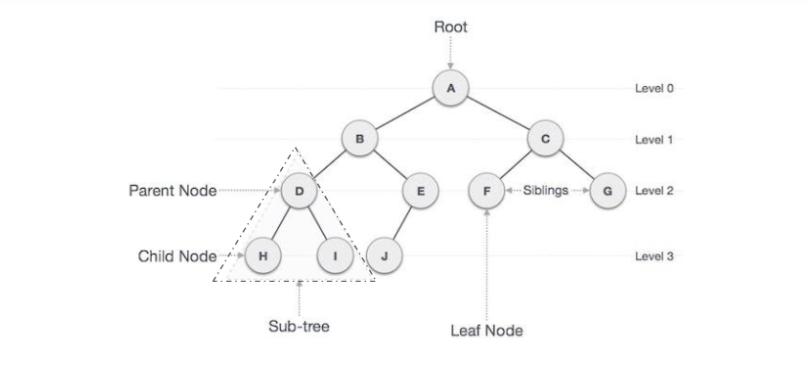

## Tree

A tree is a hierarchical data structure defined as a collection of nodes. Nodes represent value and nodes are connected by edges. A tree has the following properties:

* The tree has one node called root. The tree originates from this, and hence it does not have any parent.
* Each node has one parent only but can have multiple children.
* Each node is connected to its children via edge.

